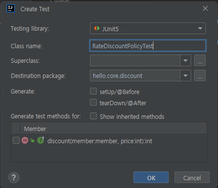
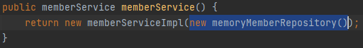
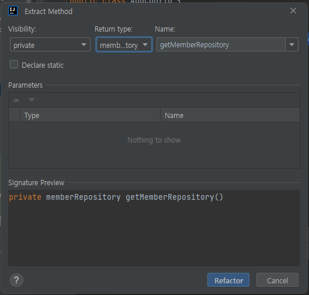

## IntelliJ에서 단축키가 어떤 것이 있는지 검색하는 기능이다

Setting에 들어가서 Keymap에 들어간 후 원하는 기능을 검색하면 오른쪽에 단축키 세팅이 나온다.

## Generate 단축키

Alt+Insert 누르면 Generate 창이 나온다.

- getter/setter : get,set 자동구현
- constructor : 생성자 자동구현
- toString : 출력할 때 좀 더 편하게 보기 위한 메서드

## 코드에 오류 발생했을 때 해결 단축키

Alt + Enter 누르면 어떻게 해결할 지 나온다.

* 인터페이스 상속받을 때 구현 메서드들 적을 때 유용
* 자동 import

## 코드 빌드, 실행 단축키

Ctrl + Shift + F10

## 테스트 코드 작성 단축키

테스트 하고싶은 메서드에다가

Ctrl + shift + T

Test Class를 만들어준다.

## 메서드가 어떤 경로에서 오는지 확인하는 단축키

경로를 알고싶은 메서드에다가 Ctrl 누른 상태로 클릭

## 리팩토링 단축키

**메서드 추출 리팩토링**

추출하고 싶은 메서드를 드래그 해서

Ctrl + Alt + M

리턴 타입과 이름을 정의한 후 리팩터링 하면 관련 메서드들 **한꺼번에 다 변경**
