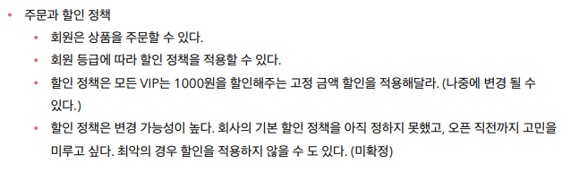
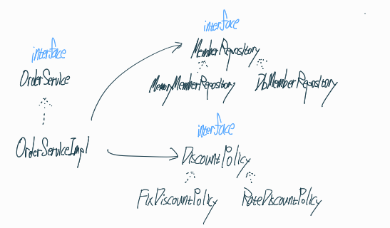
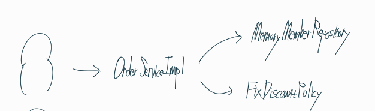
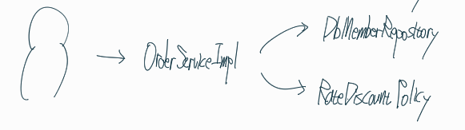
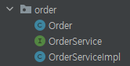

## 주문과 할인 정책을 보고 협력관계를 파악한다




클라이언트가 주문을 했을 때 어떻게 흘러가는지까지 표시하였다.

## 협력 관계를 바탕으로 실제 설계도를 그린다.

**실제 역할과 구현**



**실제 만들어지는 객체**





어떤 저장소를 사용할 것인지, 어떤 할인정책을 채택할 것인지에 따라 실제 동적으로 만들어지는 객체는 달라진다.

## 먼저 할인 정책과 관련된 역할과 구현체를 만들어보자


discount라는 패키지를 따로 만들어서 그 안에 만들었다.

**DiscountPolicy 인터페이스** [역할]

```java
package hello.core.discount;

import hello.core.member.member;

public interface DiscountPolicy {

    /**
     * @return 할인 대상 금액
     */
    int discount(member member, int price);

}
```

할인을 계산해주는 메서드가 구현되어야 한다.

리턴값으로는 할인대상금액을 반환하도록 주석 처리하였다.

**FixDiscountPolicy 클래스** [구현체]

```java
package hello.core.discount;

import hello.core.member.grade;
import hello.core.member.member;

public class FixDiscountPolicy implements DiscountPolicy {

    private int discountFixAmount = 1000;

    @Override
    public int discount(member member, int price) {
        if (member.getGrade() == grade.VIP) {
            return discountFixAmount;
        }
        return 0;
    }
}
```

위 인터페이스를 기반으로 만든 구현체이다.

고정할인을 채택하였고 1000원 할인을 기본으로 한다. 등급이 VIP일 경우 할인금액을 반환하고 나머지 경우에는 0을 반환한다.

## 주문 엔티티를 구현해보자

```java
package hello.core.order;

public class Order {

    private Long memberId;
    private String itemName;
    private int itemPrice;
    private int discountPrice;
    
    // 이후 constructor, getter/setter를 이용해 만듬
    
    public int calculatePrice() {
        return itemPrice - discountPrice;
    }
    
    @Override
    public String toString() {
        return "Order{" +
                "memberId=" + memberId +
                ", itemName='" + itemName + '\'' +
                ", itemPrice=" + itemPrice +
                ", discountPrice=" + discountPrice +
                '}';
    }
}
```

회원아이디, 상품이름, 상품금액, 할인적용금액을 구현했다.

그 후 할인 금액을 계산하는 메서드를 구현하였다.

## 주문 서비스를 구현해보자



order라는 패키지 안에 order 엔티티, orderservice 인터페이스, orderServiceImpl 클래스를 구현하였다.

**OrderService interface** [역할]

```java
package hello.core.order;

public interface OrderService {
    Order createOrder(Long memberId, String itemName, int itemPrice);
}
```

주문을 생성하는 메서드를 구현하였다.

**OrderService class** [구현체]

```java
package hello.core.order;

import hello.core.discount.DiscountPolicy;
import hello.core.discount.FixDiscountPolicy;
import hello.core.member.member;
import hello.core.member.memberRepository;
import hello.core.member.memoryMemberRepository;

public class OrderServiceImpl implements OrderService {

    private final memberRepository memberRepository = new memoryMemberRepository();
    private final DiscountPolicy discountPolicy = new FixDiscountPolicy();

    @Override
    public Order createOrder(Long memberId, String itemName, int itemPrice) {
        member member = memberRepository.findById(memberId);//회원조회역할
        int discountPrice = discountPolicy.discount(member, itemPrice);//할인정책적용되는지 판단

        return new Order(memberId, itemName, itemPrice, discountPrice);//일단 할인금액이 적용된 order entity를 반환하는걸로 했음
    }
}

```

실제로 주문 생성하는 메서드를 구현하였다.

**이 경우에는 discount와 order가 역할이 서로 분리되어있어 단일책임이 보장되므로 잘 짜여진 코드라고 할 수 있다.**

## 테스트를 진행해보자

**main method 이용**

```java
public class OrderApp {
    public static void main(String[] args) {
        memberService memberService = new memberServiceImpl();
        OrderService orderService = new OrderServiceImpl();

        Long memberId = 1L;
        member member = new member(memberId, "memberA", grade.VIP);
        memberService.join(member);

        Order order = orderService.createOrder(memberId, "itemA", 10000);

        System.out.println("order = " + order);
        System.out.println("order = " + order.calculatePrice());
    }
}
```

**Junit 이용**

```java
public class OrderServiceTest {
    memberService memberService = new memberServiceImpl();
    OrderService orderService = new OrderServiceImpl();

    @Test
    void createOrder() {
        Long memberId = 1L;
        member member = new member(memberId, "memberA", grade.VIP);
        memberService.join(member);

        Order order = orderService.createOrder(memberId, "itemA", 10000);
        Assertions.assertThat(order.getDiscountPrice()).isEqualTo(1000);
    }
}
```

