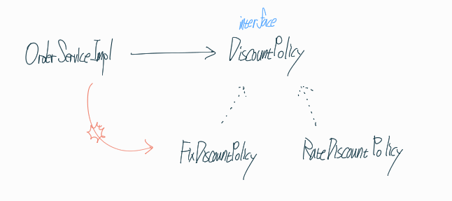
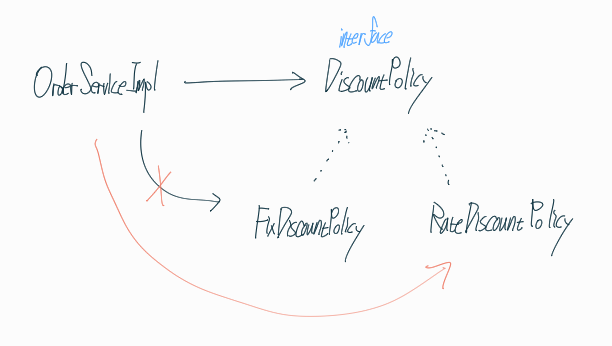
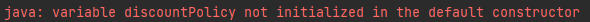
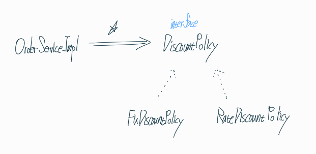

## 새로운 할인 정책을 만들어보자

```java
public class RateDiscountPolicy implements DiscountPolicy{

    private int discountPercent = 10;

    @Override
    public int discount(member member, int price) {
        if (member.getGrade() == grade.VIP) {
            return price * discountPercent / 100;
        } else {
            return 0;
        }
    }
}
```

10% 할인해주는 RateDiscountPolicy를 만들었다.

## 테스트 해보자

```java
class RateDiscountPolicyTest {
    RateDiscountPolicy discountPolicy = new RateDiscountPolicy();

    @Test
    @DisplayName("VIP는 10% 할인이 적용되어야 한다")
    void vip_right() {
        //given
        member member = new member(1L, "memberVIP", grade.VIP);
        //when
        int discount = discountPolicy.discount(member, 10000);
        //then
        Assertions.assertThat(discount).isEqualTo(1000);
    }

    @Test
    @DisplayName("VIP가 아니면 할인이 적용되지 않아야 한다")
    void vip_not() {
        //given
        member member = new member(2L, "memberBASIC", grade.BASIC);
        //when
        int discount = discountPolicy.discount(member, 10000);
        //then
        Assertions.assertThat(discount).isEqualTo(0);
    }
}
```

VIP인 경우, VIP가 아닌경우 모두 테스트 해보는것이 좋다.

**할인 정책 만을 테스트 할 수 있어서 효율적이다.**

## 실제 주문(Order) 서비스에 적용시켜보자

```java
// private final DiscountPolicy discountPolicy = new FixDiscountPolicy();
private final DiscountPolicy discountPolicy = new RateDiscountPolicy();
```

Fix -> Rate 끝.

## 실제로 잘 써진 코드인지 판단해보자

- 역할과 구현으로 나누어서 구현을 했다
- 다형성을 활용하였다
- 객체지향 설계 원칙을 준수했다?

**DIP를 준수했는가**

```java
private final DiscountPolicy discountPolicy = new FixDiscountPolicy();
```



그림과 같이 구현체인 구체 클래스에도 함께 의존하고 있기 때문에

DIP 위반이다

**OCP를 준수했는가**

```java
// private final DiscountPolicy discountPolicy = new FixDiscountPolicy();
private final DiscountPolicy discountPolicy = new RateDiscountPolicy();
```



위 코드는 클라이언트인 OrderServiceImpl이다.

클라이언트가 코드를 변경하게 하면 OCP 위반이다.

k5를 타던 에쿠스를 타던 자동차를 운전할 수 있으면 된다. 하지만 이 경우에는 **자동차의 면허증, 라이센스(Fix -> Rate)를 다시 발급받으라는 소리와 마찬가지.**

## 어떻게 DIP와 OCP를 지키면서 코드를 짤 수 있을까?

DIP를 준수하기 위해서는 **추상화(interface)만을 의존하도록** 의존관계를 변경해보자

```java
private DiscountPolicy discountPolicy;
```

근데 구현체가 없는데 어떻게 실행 가능할까?



당연히 오류 발생



이 문제를 해결하기 위해서는

**누군가가 대신 객체를 생성하고 주입해주어야 한다.**

