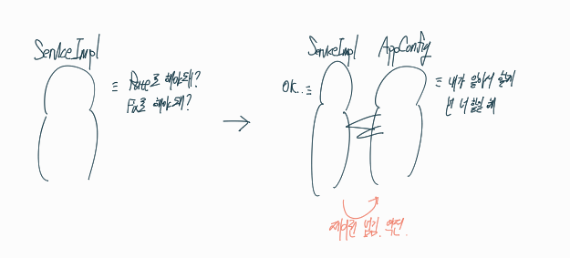
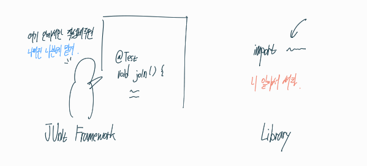
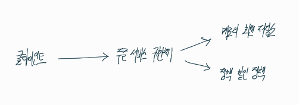

## 본격적으로 스프링을 적용시키기 전에 자주 나오는 용어들을 살펴보자

이때까지 배운 예제 만들기를 바탕으로 3가지의 용어들을 살펴보자

## IoC 제어의 역전

Inversion of Control

**프로그램의 제어 흐름을 직접 제어하는 것이 아니라 외부에서 관리하는 것**

```AppConfig```로 인해 클라이언트단 ```ServiceImpl```에서는 구현체를 직접 제어할 필요가 없어진것.

`ServiceImpl`는 어떤 구현 객체가 실행되는지 모른다. 그저 묵묵히 실행만 할 뿐.



## 프레임워크와 라이브러리의 차이

**제어의 주체가 누구인가에 따라 나눠진다.**



## DI 의존관계 주입

Dependency Injection

의존관계 역전 원칙을 따르기 위한 한가지 방법이다.

**정적인 클래스 의존 관계**

`OrderServiceImpl`는 `OrderService`의 구현체이므로 상속받고 `MemberRepository`와 `DiscountPolicy`를 각각 상속 받는 관계를 가진다. 저번 시간에 배웠던 클래스 다이어그램을 참고하자

이는 App을 직접 실행시키지 않아도 분석할 수 있다.

하지만 어떤 객체가 (`Fix` or `Rate`) 주입될지는 알 수 없다.

**동적인 객체 인스턴스 의존 관계**

App 실행 시점(runtime)에서 실제 구현 객체를 생성하고 클라이언트에 전달에서(`AppConfig`의 역할) 클라이언트와 서버의 실제 의존관계가 연결되는 것(실제로 연결 되었음을 의미)을 **의존관계 주입**이라고 한다.



객체 인스턴스를 생성하고 참조값을 전달해서 연결.

## IoC Container, DI Container

`AppConfig`가 IoC 컨테이너, DI 컨테이너가 된다.

**객체를 생성하고 관리, 의존관계를 연결해 주는 역할**을 하게 된다.

제어의 역전은 너무 범용적이므로 의존관계 주입에 초점을 맞추어 DI 컨테이너라고 많이 불린다.