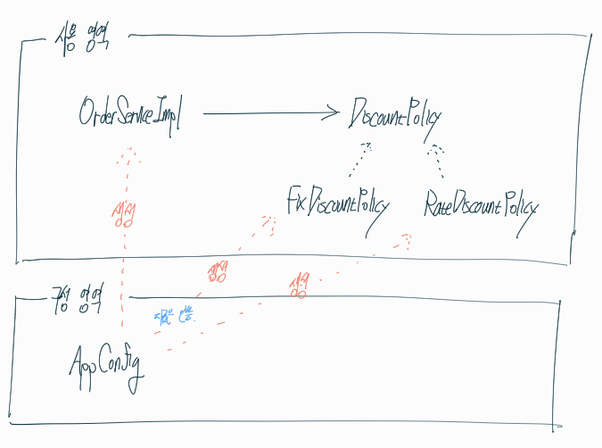

## AppConfig를 활용해 새로운 할인 정책을 적용시켜보자

이전에는 ServiceImpl라는 클라이언트 단에서 직접 바꿔야 했다면,

지금은 AppConfig라는 클래스를 만들어 **사용 영역과 구성 영역**으로 나누어서 클라이언트 단에서 신경쓰지 않도록 하였다.

즉, AppConfig에서

```java
 private DiscountPolicy DiscountPolicy() { 
     return new RateDiscountPolicy(); //FixDiscountPolicy() 대신
}
```

만 수정해주면 된다.


