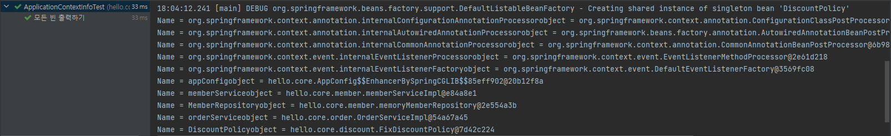
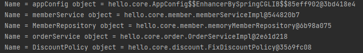

## 스프링 컨테이너에 저장된 모든 빈 객체를 조회해보자(꺼내보자)

컨테이너를 생성하고 설정을 지정했으면

이제 데이터를 조회하는 일을 해보자

## 우선 테스트를 위해 코드에 컨테이너를 생성해보자

```java
ApplicationContext ac = new AnnotationConfigApplicationContext(AppConfig.class);
```

이렇게 해버리면 문제가 생긴다.

바로 `getBeanDifinition()`메소드를 사용을 못한다는 것.

이유를 살펴보니 `ApplicationContext` `interface`를 상속으로 삼았다는 것.

`getBeanDifinition()`은 `AnnotationConfigApplicationContext` 의 **부모 클래스**에서 상속받은 메소드라

`ApplicationContext` `interface`에는 구현되지 않은 메소드인 것.

이렇게 구조를 짠 이유는 바로

**ISP (인터페이스 분리 원칙 : Interface Segregation Principal)을 지키기 때문이다.**

```java
AnnotationConfigApplicationContext ac = new AnnotationConfigApplicationContext(AppConfig.class);
```

이렇게 해줘야 한다.

## 모든 빈을 출력할 테스트 코드를 작성해보자

```java
@Test
@DisplayName("모든 빈 출력하기")
void findAllBean() {
    String[] beanDefinitionNames = ac.getBeanDefinitionNames();
    for (String beanDefinitionName : beanDefinitionNames) {
        Object bean = ac.getBean(beanDefinitionName);
        System.out.println("Name = " + beanDefinitionName
                + " object = " + bean);
    }
}
```

컨테이너를 만들었으면 `getBeanDeifinitionNames()`메서드를 통해 모든 빈의 이름을 가져오고 이거를 `String[]`배열에 넣자

이후 `향상된 for문`을 사용하여 배열에서 이름을 하나하나 빼내보자

`getBean()`을 사용하여 매개변수에 빈 이름을 넣고 **객체를 꺼내보자**

꺼낸 빈 객체와 빈 이름을 출력하자



이렇게 이름과 객체가 출력되는 것을 알 수 있다.

## 우리가 등록한 빈 만을 출력해보자

빈은 총 2가지로 나누어진다

- `ROLE_APPLICATION` : 일반적으로 사용자가 정의한 빈 

- `ROLE_INFRASTRUCTURE` : 스프링이 내부에서 사용하는 빈

우리가 등록한 빈 만 출력해보자

```java
@Test
@DisplayName("애플리케이션 빈 출력하기")
void findApplicationBean() {
    String[] beanDefinitionNames = ac.getBeanDefinitionNames();
    for (String beanDefinitionName : beanDefinitionNames) {
        BeanDefinition beanDefinition = ac.getBeanDefinition(beanDefinitionName);

        if (beanDefinition.getRole() == BeanDefinition.ROLE_APPLICATION) {
            Object bean = ac.getBean(beanDefinitionName);
            System.out.println("Name = " + beanDefinitionName
                    + " object = " + bean);
        }
    }
}
```

`getBeanDefinition()`을 사용해서 매개변수로 이름을 넣고 빈의 메타데이터들을 꺼내와보자

```java
beanDefinition.getRole() == BeanDefinition.ROLE_APPLICATION
```

이게 뭔소리나면

`BeanDefinition.ROLE_APPLICATION`은 실제로 `public final static int`타입으로 `0`으로 저장된 것이다.

즉, 빈의 메타데이터에서 `getRole()`메서드를 사용해서 꺼낸게 0이면 **우리가 직접 등록한 애플리케이션 빈이라는 소리**이다.

이후에 위와 똑같이 bean 객체, bean 이름을 가져와서 프린트 한다.



잘 출력되는 것을 알 수 있다.

## 
