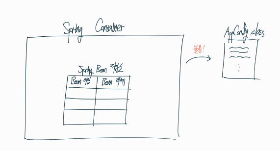
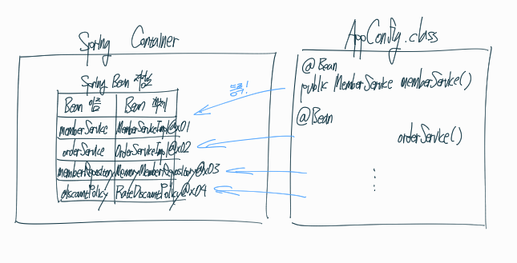
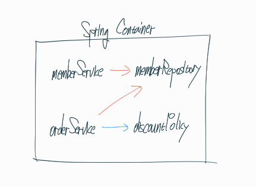

## 스프링 컨테이너를 생성해보자

컨테이너를 생성해보자

```java
ApplicationContext applicationContext = new AnnotationConfigApplicationContext(AppConfig.class);
```

`ApplicationContext`를 스프링 컨테이너라고 하고 `interface`형태이다.

- `XML` 
- `java class` 

두가지 중 한가지를 선택하여 컨테이너를 만들 수 있다.

지금까지 해온 방식은 `AppConfig`라는 `java class`를 통해서 만든 컨테이너이다.

`java class` 방식을 사용해서 만들기 위해 실제 객체 구현체를 `AnnotationConfigApplicationContext`로 하였다. (`ApplicationContext`의 실제 구현체)

**밑에는 스프링 컨테이너를 생성할 시에 어떠한 과정을 거치는지 설명 할 것이다.**

## 스프링 컨테이너를 생성한다.



`AppConfig.class`를 구성정보로 지정하여 스프링 컨테이너를 생성한다.

## 스프링 빈을 등록한다.



컨테이너는 파라미터로 넘어온 `AppConfig.class`설정 클래스 정보를 사용해서 스프링 빈 저장소에 빈을 등록한다.

**빈 이름은 항상 다른 이름을 부여해야 한다.**

## 스프링 빈의 의존관계를 설정한다.



설정 클래스 정보를 참고해서 의존관계를 주입한다.

(사실 의존관계 주입과 생성자 호출이 한번에 처리된다. 의존관계 자동 주입)