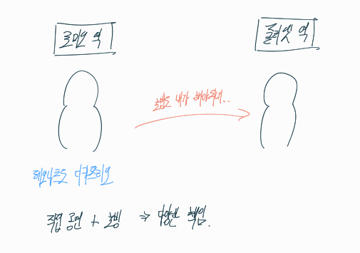
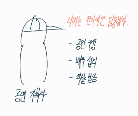
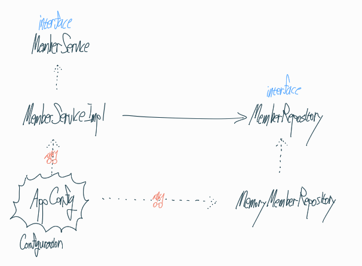
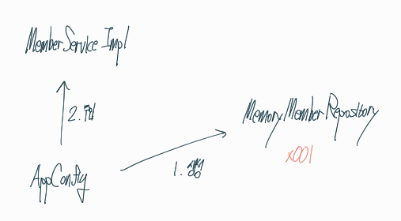

## 책임을 분리해보자

**로미오와 줄리엣 예시**

한사람에 책임이 2가지 이상이 있다면 힘들 것이다.

**관심사를 분리해보자.** 배우는 배역을 수행하는 것에만 집중 해야 한다.



배우를 섭외하고 역할에 맞게 배정하는 책임을 담당하는 **공연 기획자**가 나와야 된다.



클라이언트단인 Service 구현체에서는 실행만 책임지도록 해야 한다.

## 책임 분리를 위해 AppConfig를 만들어보자

구현 객체 생성 + 연결을 책임지는 별도의 설정 클래스

이전에는 Service에서 추상체와 구현체 둘 다 상속을 받았다면

이번에는 AppConfig라는 클래스에서 객체를 생성하도록 해보자

```java
public class AppConfig {
    public memberService memberService() {
        return new memberServiceImpl(new memoryMemberRepository());
    }

    public OrderService orderService() {
        return new OrderServiceImpl(
                new memoryMemberRepository(),
                new FixDiscountPolicy());
    }
}
```

이곳에서 **구현 객체를 생성**한 후 

**객체 인스턴스의 참조 주소값을 생성자를 통해서 주입**시켜준다.

```java
private final memberRepository memberRepository;

    public memberServiceImpl(memberRepository memberRepository) {
        this.memberRepository = memberRepository;
    }
```

member를 예로 들면

첫번째로 MemoryMemberRepository 객체를 생성한 후 생성자를 통해 참조값을 주입시키는 방식이다.





1. 먼저 AppConfig가 MemorymemberRepository 객체를 생성하고 
2. 생성자를 통해 Service에게 주입한다.

```java
private final memberRepository memberRepository;
    
private final DiscountPolicy discountPolicy;

public OrderServiceImpl(memberRepository memberRepository, DiscountPolicy discountPolicy) {
    this.memberRepository = memberRepository;
    this.discountPolicy = discountPolicy;
}
```

생성자를 통해 주입시켜줘서 Service 입장에서는 어떤 구현 객체가 들어올지는 알 수 없게 된다.

이렇게 Service단에서는 **구현체를 따로 구현하기 위해 코드 수정할 필요 없이**

**실행**에만 초점을 두면 된다.


클라이언트인 MemberServiceImpl나 OrderService 입장에서 보면

의존관계를 **외부에서 주입**해주는 것 같다(AppConfig의 주입)고 해서

**DI (Dependency Injection) 의존관계 주입, 의존성 주입**

이라고 부른다.

## 의존관계를 주입한 이후에 App을 테스트해보자

**회원 도메인**

```java
AppConfig appConfig = new AppConfig();
memberService memberService = appConfig.memberService();
```

앞에서 만든 MemberApp class 내용에 MemberRepository를 선택하는 코드만 수정하면 된다.

Service단에서 제어하지 않고, appConfig에서 객체를 생성하는 모습을 볼 수 있다.

DIP를 잘 지켜졌다고 말할 수 있다!

**할인정책 도메인**

```java
AppConfig appConfig = new AppConfig();
memberService memberService = appConfig.memberService();
OrderService orderService = appConfig.orderService();
```

위와 마천가지이다.

## Junit을 통해 테스트 해보자

이전 코드

```java
memberService memberService = new memberServiceImpl();
```

Service단에서 구현까지 책임져야 되는 모습을 볼 수 있다.

DI를 주입한 이후 코드

```java
memberService memberService;
    
@BeforeEach // @Test 이전에 실행시키는 코드
public void beforeEach() {
    AppConfig appConfig = new AppConfig();
    memberService = appConfig.memberService();
}
```

Test를 위해서 Test코드 이전에 미리 구현체를 만들어놓는 작업을 거친다.

이후 코드는 전과 동일하다.


잘 뜨는 것을 볼 수 있다.

## AppConfig 클래스를 고쳐보자 [리팩터링]

```java
public class AppConfig {
    public memberService memberService() {
        return new memberServiceImpl(new memoryMemberRepository());
    }

    public OrderService orderService() {
        return new OrderServiceImpl(
                new memoryMemberRepository(),
                new FixDiscountPolicy());
    }
}
```

잘 보면 memoryMemberRepository가 두개의 서비스에 중복으로 쓰임을 알 수 있다.

중복으로 쓰일 경우 나중에 Db나 Other 저장소로 바꾸기 위해 코드를 수정할 때 **일일이 다 수정해야 하는 번거로움이 생긴다.**

이를 리팩토링 해보자

```java
public class AppConfig {
    public memberService memberService() {
        return new memberServiceImpl(MemberRepository());
    }

    private memberRepository MemberRepository() {
        return new memoryMemberRepository();
    }

    public OrderService orderService() {
        return new OrderServiceImpl(MemberRepository(), DiscountPolicy());
    }

    private DiscountPolicy DiscountPolicy() {
        return new FixDiscountPolicy();
    }
}
```

리팩토링 함으로써 코드를 수정할 때 **MemberRepository() 부분만 수정하면 된다.**

또한, **역할과 구현이 나누어져 한눈에 파악하기 좋아진다.**
