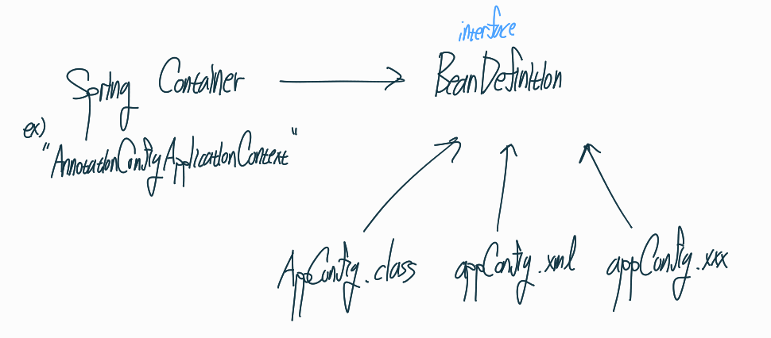
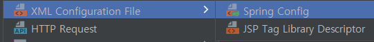
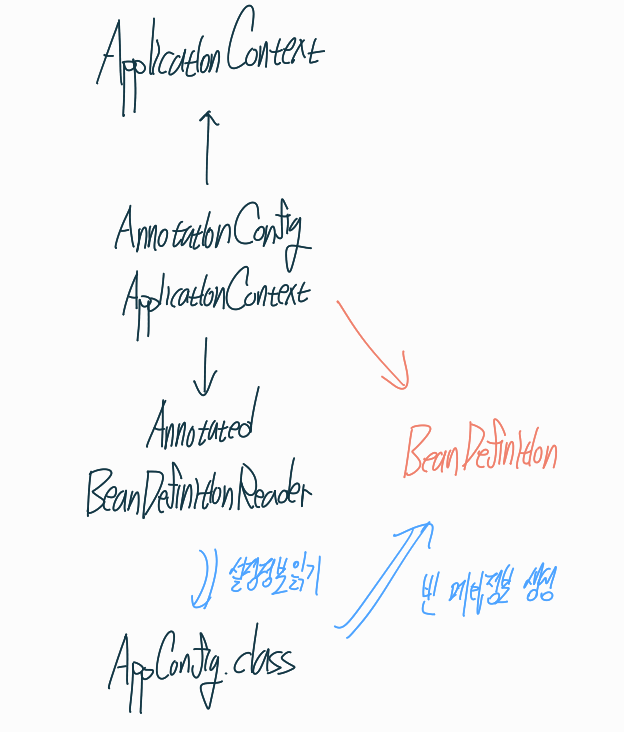

## 스프링 컨테이너의 기능들에 대해 알아보자

우리는 지금까지 `ApplicationContext`라는 컨테이너를 생성하고 설정 정보를 넣고 빈을 조회까지 해보았다.

이제 이 `ApplicationContext`라는 인터페이스를 자세히 들여다보자



이렇게 인터페이스를 상속받아서 의존관계를 통해 다양한 기능들을 가져온다.

이런 상속 다이어그램이 그려지는데 이중에서 우리가 지금까지 한 것중에 대부분은 `BeanFactory`가 제공해주었다. 이것은 **빈을 관리하고 검색하는 기능**을 제공한다.

다른것들은 어떠할까?

- `MessageSource` : 메시지소스를 활용한 국제화 기능
- `EnvironmentCapable` : 환경변수
- `ApplicationEventPublisher` : 애플리케이션 이벤트
- `ResourceLoader` : 편리한 리소스 조회

등 여러가지가 있다.

## `BeanFactory`가 컨테이너에요, `ApplicationContext`가 컨테이너에요?

애플리케이션을 개발할 때는 단순히 빈을 관리하고 조회하는 것만으로 끝나지 않는다.

다른 수많은 부가기능들을 요구하게 되는데 이 기능들을 전부 상속받는 컨테이너가 `ApplicationContext`이다.

앞으로는 이것을 컨테이너로 사용할 것이다.

## `ApplicationContext`는 인터페이스인데 실제 구현체는 뭐에요?

**설정 정보를 어느 파일로 지정하느냐**에 따라 달라지게 된다.

- `AnnotationConfigApplicationContext` : 자바 어노테이션을 활용해 클래스 파일로 설정정보 지정
- `GenericXmlApplicationContext` : xml 파일로 설정정보 설정
- `XxxApplicationContext` : 기타 다른파일도 지원할 것이다. ex) Groovy, json, ...

첫번째는 그냥 지금까지 해왔던 대로

```java
new AnnotationConfigApplicationContext(AppConfig.class);
```

객체 생성해주고 `AppConfig.class`를 설정정보로 넘겨주면 된다.

## Xml로 설정정보를 넘겨보자

xml로 설정한 컨테이너가 잘 작동하는지 Test코드를 작성해보자

우선 `AppConfig.xml` 파일부터 만들어보자

`java` 관련 파일 이외는 `resources` 디렉토리 안에 넣으면 된다.



감사하게도 intelliJ에서 `xml` 파일까지 지원해준다.

```
<?xml version="1.0" encoding="UTF-8"?>
<beans xmlns="http://www.springframework.org/schema/beans"
       xmlns:xsi="http://www.w3.org/2001/XMLSchema-instance"
       xsi:schemaLocation="http://www.springframework.org/schema/beans http://www.springframework.org/schema/beans/spring-beans.xsd">

    <bean id="memberService" class="hello.core.member.memberServiceImpl">
        <constructor-arg name="memberRepository" ref="memberRepository"/>
    </bean>

    <bean id="memberRepository" class="hello.core.member.memoryMemberRepository" />

    <bean id="orderService" class="hello.core.order.OrderServiceImpl">
        <constructor-arg name="memberRepository" ref="memberRepository"/>
        <constructor-arg name="discountPolicy" ref="discountPolicy"/>
    </bean>

    <bean id="discountPolicy" class="hello.core.discount.RateDiscountPolicy"/>
</beans>
```

`<beans>`태그가 자동으로 만들어져있을것이다. 자세히 알 필욘 없고 그냥 최상위 태그구나라는것만 알아두자.

`<bean>`태그를 통해 빈을 설정해줄 수 있다. `<constructor-arg>`태그를 통해 생성자를 지정해줄수도 있다.

**자바 클래스 코드와 진짜 유사하다는 것을 알 수 있다.**

다 만들었으면 이제 테스트 코드를 작성해보자

```java
public class XmlAppContextTest {
    ApplicationContext ac = new GenericXmlApplicationContext("AppConfig.xml");

    @Test
    void xmlTest() {
        memberService memberService = ac.getBean("memberService", memberService.class);
        Assertions.assertThat(memberService).isInstanceOf(memberService.class);
    }
}
```

`GenericXmlApplicationContext` 클래스를 이용해 컨테이너를 만들것이며, 설정정보는 `AppConfig.xml`이다.

컨테이너에서 빈을 조회하고 조회한 빈이 실제 객체와 같은지 비교하는 것이다.

테스트가 성공했음을 알 수 있다.

**이처럼 xml 파일로도 설정정보를 넘겨 컨테이너를 만들 수 있다는 사실을 알았다.**

## 컨테이너가 설정정보를 읽어서 빈을 만든다는 것은 알았는데, 어떤 방식으로 읽는거에요?

컨테이너가 직접 읽어서 가져오는게 아니다.

인터페이스인 `BeanDefinition`의 구현체를 읽는 것이다. 그림으로 이해해보자



**역할과 구현을 나눈 케이스**라고 보면 된다.

스프링 컨테이너는 자바 코드, xml을 몰라도 된다. `BeanDefinition`만 알면 된다.

## `BeanDefinition`이 뭔데요?

빈 설정 메타정보이다.

`@bean`, `<bean>` 하나하나에 메타정보가 생성된다.

**스프링 컨테이너는 이를 보며 스프링 빈을 생성한다.**

## 다시 돌아와서 어떤 방식으로 읽는지 조금 더 깊이 있게 알아보자

그림

```java
public class AnnotationConfigApplicationContext extends GenericApplicationContext implements AnnotationConfigRegistry {

    private final AnnotatedBeanDefinitionReader reader;
    ...
}       
```

보다시피 `AnnotationBeanDefinitionReader`를 상속하게 되는데, 이 클래스가 `.class`, `.xml`, `.xxx`로 되있는 설정 정보를 읽어오는 역할을 하는 것이다.

그 후 읽어온 정보들을 토대로 `BeanDefinition`을 생성하게 된다.

```java
@Test
void BeanDefinitionTest() {
    String[] beanDefinitionNames = ac.getBeanDefinitionNames();
    for (String beanDefinitionName : beanDefinitionNames) {
        BeanDefinition beanDefinition = ac.getBeanDefinition(beanDefinitionName);

        if (beanDefinition.getRole() == BeanDefinition.ROLE_APPLICATION)
            System.out.println("beanDefinitionName = " + beanDefinitionName);
            System.out.println("beanDefinition = " + beanDefinition);
    }
}
```

전에 빈 조회 파트에서 보았다시피

`getRole()`을 통해 0이면 우리가 직접 추가한 빈 만을 조회한다는 의미이므로

이번에는 `beanDefinition`까지 출력해보는 것이다.

**자바 클래스 설정정보를 통해 만든 빈 매타정보**

```
beanDefinitionName = memberService
beanDefinition = Root bean: class [null]; scope=; abstract=false; lazyInit=null; autowireMode=3; dependencyCheck=0; autowireCandidate=true; primary=false; factoryBeanName=appConfig; factoryMethodName=memberService; initMethodName=null; destroyMethodName=(inferred); defined in hello.core.AppConfig
```

**xml 설정정보를 통해 만든 빈 매타정보**

```
beanDefinitionName = memberService
beanDefinition = Generic bean: class [hello.core.member.memberServiceImpl]; scope=; abstract=false; lazyInit=false; autowireMode=0; dependencyCheck=0; autowireCandidate=true; primary=false; factoryBeanName=null; factoryMethodName=null; initMethodName=null; destroyMethodName=null; defined in class path resource [AppConfig.xml]
```

- BeanClassName: 생성할 빈의 클래스 명(자바 설정 처럼 팩토리 역할의 빈을 사용하면 없음)
- factoryBeanName: 팩토리 역할의 빈을 사용할 경우 이름, 예) appConfig
- factoryMethodName: 빈을 생성할 팩토리 메서드 지정, 예) memberService
- Scope: 싱글톤(기본값)

- lazyInit: 스프링 컨테이너를 생성할 때 빈을 생성하는 것이 아니라, 실제 빈을 사용할 때 까지 최대한 생성을 지연처리 하는지 여부 
- InitMethodName: 빈을 생성하고, 의존관계를 적용한 뒤에 호출되는 초기화 메서드 명 
- DestroyMethodName: 빈의 생명주기가 끝나서 제거하기 직전에 호출되는 메서드 명 
- Constructor arguments, Properties: 의존관계 주입에서 사용한다. (자바 설정 처럼 팩토리 역할의 빈을 사용하면 없음)

빈을 만드는 방식은 다양하지만 크게 2가지로 나눌 수 있다.

한개는 직접 `BeanDefinition`을 작성하는 것이며 `xml`이라 알고있자.

나머지 한개는 `FactoryBean` 방식이다. `Annotation`활용하는 것으로 알고 있자.

너무 깊이 들어가지 말고 일단 여기까지 알고 있자

**사실 `BeanDefinition`을 직접 정의하거나 사용할 일은 거의 없다.**

`BeanDefinition`이 어떻게 사용되고 있는지 컨테이너 입장에서 추상화의 개념을 떠올리며 정리하자.